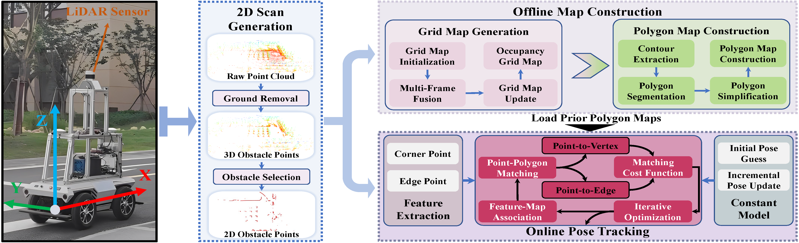

# ERPoT: Effective and Reliable Pose Tracking for Mobile Robots Based on Lightweight and Compact Polygon Maps
### Motivation

+ The previous pose tracking approaches, while valuable, **often face challenges such as the large size of prior maps**, especially in **large-scale outdoor environments**, which can hinder **computational efficiency** and **map storage**.
+ Complex pose tracking processes with **specific semantic clues** and **structure characteristics** in the environment, that **may not** always guarantee **effectiveness** and **reliability**.
+ <span style="color:#E86A51">In light of the above challenges, there is a pressing need for innovative solutions that can offer both **compact map form** and **reliable localization** **techniques**.</span>


Motivated by the requirements of compact map form and reliable localization mentioned above, we propose an effective and reliable pose tracking approach for mobile robots based on the novel prior map, called ERPoT. Note that the proposed pose tracking framework is a general solution that applies to various environments and is not limited to environments containing specific semantic elements.




### Pose tracking process for KITTI


### Pose tracking process for Newer College


### Pose tracking process for Self dataset


To run this project in minutes, check  [Dependency](#0-Dependency) and [Quick Start](#1-Quick-Start). Please refer to README.md in each folder to learn more about the contents.

Please cite the following paper if you use this project in your research: 

> H. Gao, Q. Qiu, H. Liu, D. Liang, C. Wang, and X. Zhang, "ERPoT: Effective and Reliable Pose Tracking for Mobile Robots Based on Lightweight and Compact Polygon Maps," awaiting submission, 2024.


## Table of Contents

* [Dependency](#0-Dependency)
* [Quick Start](#1-Quick-Start)
* [Setup](#2-Setup)

## 0. Dependency
- [ROS](http://wiki.ros.org/ROS/Installation) (tested with Noetic 1.16.0)
- [Ceres](http://ceres-solver.org/installation.html) (tested with 1.14.0)
- [OpenCV](https://github.com/opencv/opencv) (tested with 4.2.0)
- [slam_karto](https://github.com/ros-perception/slam_karto) and [open_karto](https://github.com/ros-perception/open_karto) (this project already includes source code)

## 1. Quick Start

The project has been tested on 20.04 (ROS Noetic), and it can also be tested in other ROS versions (such as melodic with Ubuntu 18.04 or earlier versions). In the following, we will take the ROS Noetic version as an example. 

1. First, create and initialize a ROS workspace, and run the following commands to clone this repo and build it:

      ```
   $ mkdir -p ~/catkin_ws/src
   $ cd ~/catkin_ws/src
   $ catkin_init_workspace
   $ git clone https://github.com/ghm0819/ERPoT
   $ cd ..
   $ catkin_make
   ```
   
   If you encounter a problem with missing packages during the installation process, please install the corresponding package based on the specific compilation error.
   
   


2. According to the map info (.bin) under the folder `./map/` and our provided [test datasets](), run the following commands. Note that, the initial pose of the test dataset should be modified in `./config/tracking_params.yaml`, and the parameter `map path` in `./launch/pose_tracking.launch` of the test dataset also needs to be modified.

      ```
   $ roslaunch ERPoT pose_tracking.launch
   ```
   
   And open a new terminal and play the bag (only LiDAR data).
   ```
   rosbag play --clock bag_name.bag --topics /velodyne_points
   ```

   Finally, you can view the current pose tracking effect through RVIZ (`tracking.rviz`).


## 2. Detailed  Description

1. **Ground segmentation**

   If you want to see the generated effect of 2D scan (2D obstacle points), change the parameter `cloud_topic` in `./launch/demo.launch`, open a new terminal, and run the following commands.

   ```
   roslaunch ERPoT demo.launch
   ```

   another terminal

   ```
   rosbag play --clock bag_name.bag
   ```

​	   Finally, you can view the current ground segmentation effect through RVIZ (`demo.rviz`).

2.  **Build a prior polygon map**

   At first, you should provide the `tf` information between `base_link` and `odom`, as well as between `base_link` and `laser`. Note that the localization information is obtained from the provided ground_truth or 3D LiDAR SLAM (such as LIO-SAM, LeGO-SLAM), rather than depends on the scan matching results (the original version of karto_slam).

   ```
   roslaunch ERPoT build_map.launch
   ```

   another terminal

   ```
   rosbag play --clock bag_name.bag
   ```

   Note that the above bag file contains two topics: `/cloud_topic` and `/tf`, you can make use of [bag_tools](https://github.com/srv/srv_tools) to merge these two topics into one ROS bag file.

   When the grid map construction is completed, open a new terminal, and save the grid map to a special path.

   ```
   rosrun map_server map_saver -f /map_path/map_name
   ```

   Finally, the prior polygon map is obtained through the following command.
   
   ```
   rosrun ERPoT generate_polygon /map_path/map_name
   ```
   
   There are some important parameters used to generate the grid map and the corresponding polygon map, which need to be set according to specific experimental scenarios to achieve optimal results. You can consider adjusting them near the default values.

## Acknowledgment

We make use of [**patchwork++**](https://github.com/url-kaist/patchwork-plusplus-ros) for ground segmentation and [**slam_karto**](https://github.com/ros-perception/slam_karto) for grid map generation.

